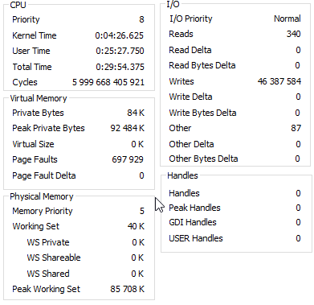

# 5 букв

## Введение

У Т-Банка такая игра есть «[5 букв](https://www.tbank.ru/finance/blog/legendary-game/)». Не только у него, разумеется, но именно у них я в первые в нее сыграл. Разные стратегии есть, как в нее играть. Одна из стратегий, возможно, не самая удачная, но понятная, состоит в том, чтобы пользуясь определенным набором 4-х слов открыть как можно больше букв за первые 4 хода, а потом в оставшиеся два хода угадать слово.

Задача состоит в том, чтобы найти эти 4 слова. У меня это были `багет вздор кумыс шпиль`. Но эту четверку я сочинил не сам, а где-то вычитал в обсуждениях игры.

## Задача

Поиск наиболее эффективных четверок, открывающих не просто 20 разных букв, но 20 наиболее популярных букв. Популярность буквы определяется частотой её использования в словаре. Словарь набирается из имен существительных в единственном числе именительном падеже.

## Реализация

Исходный список существительных русского языка взят [отсюда](http://blog.kislenko.net/show.php?id=1678) и помещен в текстовый файл `all.txt` в кодировке UTF-8.

Программа читает из файла `all.txt` все слова из 5-ти разных букв и в цикле строит максимально длинные последовательности из этих слов, покрывающие алфавит.

Время работы программы — 0:29:54.357 на компе Windows 10 64 bit, Intel(R) Core(TM) i5-3570 CPU @3.40GHz 16GB RAM

<details>
  <summary>Performance tab</summary>



</details>

Результаты работы программы в выходном каталоге `reports`.

| Файл         | Описание
|--------------|---------
| alphabet.txt | Алфавит. Для каждой буквы указана ее частотность ее использования в процентах
| all5.txt     | Словарь слов. Для каждого слова указана сумма частотностей составляющих его  букв
| allRecs.txt  | Все найденные программой последовательности 5-ти буквенных слов, покрывающие алфавит. Для каждой последовательности указана сумма частотностей букв, составляющих слова этой последовательности
| allRecs4.txt | Все найденные программой последовательности из 4-х слов. Это самый важный для дальнейшей обработки файл
| allRecs5.txt | Все найденные программой последовательности из 5-ти букв
| allRecs6.txt | Все найденные программой последовательности из 6-ти букв. Последние два файла просто любопытны, для дальнейшей работы не нужны

После завершения работы программы результаты дальнейшей ручной обработки выходных файлов располагаются в каталоге `reports/wrk`.

| Файл                               | Описание
|------------------------------------|---------
| 1-allRecs4-sorted.txt              | Отсортированный по строкам allRecs4.txt. Порядок сортировки — обратный, так, чтобы наиболее интересные строки оказались сверху
| 2-topRecs4.txt                     | Верхние строки из предыдущего файла. Максимальные по частотности последовательности
| 3-topRecs4-связь.txt               | В процессе игры оказывается, что для получения ответа часто достаточно первых трех слов. Чтобы это случалось как можно чаще, четвертое слово должно быть с минимально возможной частотностью. Такое слово — `связь`. В этом файле собраны все последовательности из предыдущего файла, содержащие `связь`
| 4-topRecs4-связь-knowns.txt        | Из предыдущего файла убрали все последовательности, которых может не оказаться в словаре T-Банка. То есть я не хочу сказать, что их там нет, но подозреваю, что часть они не включили, считая уменьшительно-ласкательными, часть — устаревшими, часть — бранными и т.д. Все такие подозрительные тут убраны
| 5-topRecs4-связь-knowns-sorted.txt | Для увеличения шансов успешно завершить игру быстро слова желательно вводить в порядке обратном их частотности, начиная со слова с максимальной частотностью. Именно так в этом файле отсортированы слова в последовательностях
| 6-best.txt                         | Опять же, для увеличения шансов успешно завершить игру быстро предпочтительны последовательности, начинающиеся со слова с максимальной частотностью. Именно так в этом файле отсортированы строки последовательностей

## Итог

### Победитель

Последовательность `пилка` (31.084), `тромб` (24.984), `недуг` (20.306) и `связь` (12.864) с общей частотностью букв 89.238 %.

### Интересно

### top from allRecs5.txt

<details>
  <summary>Лучшие последовательности из 5 слов</summary>

```text
95.710 : мазок [29.507] + сдвиг [17.767] + тупыш [15.768] + френч [20.058] + хлябь [12.609]
95.710 : зумпф [13.820] + очерк [28.347] + сдвиг [17.767] + хлябь [12.609] + штаны [23.167]
95.710 : замок [29.507] + сдвиг [17.767] + тупыш [15.768] + френч [20.058] + хлябь [12.609]
95.710 : дрязг [15.148] + филум [19.613] + хвост [20.985] + чебак [27.267] + шпынь [12.696]
95.710 : гребь [19.504] + дичок [24.123] + зумпф [13.820] + хлыст [17.103] + шнява [21.160]
95.710 : вышаг [17.906] + зумпф [13.820] + стенд [23.495] + хлябь [12.609] + чирок [27.880]
95.710 : вышаг [17.906] + зумпф [13.820] + очник [26.144] + рдест [25.232] + хлябь [12.609]
95.710 : выход [15.352] + зумпф [13.820] + рябик [23.583] + честь [19.270] + шланг [23.685]
95.710 : выход [15.352] + глубь [16.023] + сизяк [20.883] + френч [20.058] + штамп [23.393]
95.710 : выдох [15.352] + зумпф [13.820] + рябик [23.583] + честь [19.270] + шланг [23.685]
95.710 : выдох [15.352] + глубь [16.023] + сизяк [20.883] + френч [20.058] + штамп [23.393]
95.710 : выгиб [14.688] + дрянь [17.629] + зумпф [13.820] + холст [23.349] + чешка [26.224]
95.710 : всход [18.395] + глыба [21.313] + зумпф [13.820] + ничья [15.783] + штрек [26.399]
95.710 : всход [18.395] + глыба [21.313] + зумпф [13.820] + ничья [15.783] + шкерт [26.399]
95.710 : вспых [12.645] + дулеб [21.248] + князь [17.140] + чомга [24.203] + шрифт [20.474]
95.710 : вспых [12.645] + дрязг [15.148] + томан [30.850] + чубик [20.927] + шельф [16.140]
95.710 : вспых [12.645] + дрязг [15.148] + очник [26.144] + тумба [25.633] + шельф [16.140]
95.710 : вспых [12.645] + дрязг [15.148] + обмин [23.962] + тучка [27.815] + шельф [16.140]
95.710 : вспых [12.645] + дрязг [15.148] + манто [30.850] + чубик [20.927] + шельф [16.140]
95.710 : вспых [12.645] + грязь [14.338] + фенол [24.903] + чудик [20.963] + штамб [22.860]
95.710 : вспых [12.645] + грязь [14.338] + фелон [24.903] + чудик [20.963] + штамб [22.860]
95.710 : вспых [12.645] + грязь [14.338] + клинч [23.648] + обмет [24.998] + шадуф [20.080]
95.710 : вспых [12.645] + грязь [14.338] + дебош [20.970] + флинт [22.174] + чумак [25.582]
95.710 : вспых [12.645] + грязь [14.338] + дебош [20.970] + мучка [25.582] + флинт [22.174]
95.710 : вспых [12.645] + грязь [14.338] + дебош [20.970] + кумач [25.582] + флинт [22.174]
95.710 : вспых [12.645] + грязь [14.338] + дебош [20.970] + клинч [23.648] + фатум [24.108]
95.710 : вспых [12.645] + грязь [14.338] + дебош [20.970] + клинч [23.648] + муфта [24.108]
95.710 : вспых [12.645] + гольф [17.658] + резня [21.583] + чудик [20.963] + штамб [22.860]
95.710 : вспых [12.645] + глушь [14.980] + избач [22.277] + медяк [20.686] + фронт [25.122]
95.710 : взыск [16.979] + фидер [22.736] + хлябь [12.609] + чомга [24.203] + шпунт [19.183]
95.710 : взыск [16.979] + недуг [20.306] + хлябь [12.609] + чомпи [21.080] + штраф [24.735]
95.710 : взыск [16.979] + домен [24.466] + пугач [21.182] + хлябь [12.609] + шрифт [20.474]
95.710 : взыск [16.979] + демон [24.466] + пугач [21.182] + хлябь [12.609] + шрифт [20.474]
95.710 : взыск [16.979] + геном [23.823] + причт [22.218] + хлябь [12.609] + шадуф [20.080]
95.710 : взмах [19.190] + клефт [24.517] + обряд [21.233] + сычуг [13.375] + шпинь [17.395]
95.710 : взмах [19.190] + дутыш [15.272] + корчь [23.765] + плебс [21.700] + фигня [15.783]
95.710 : взмах [19.190] + дрянь [17.629] + клефт [24.517] + пошиб [21.000] + сычуг [13.375]
95.710 : вздох [16.118] + плебс [21.700] + фигня [15.783] + чумак [25.582] + штырь [16.527]
95.710 : вздох [16.118] + мучка [25.582] + плебс [21.700] + фигня [15.783] + штырь [16.527]
95.710 : вздох [16.118] + кумач [25.582] + плебс [21.700] + фигня [15.783] + штырь [16.527]
95.710 : вздох [16.118] + клефт [24.517] + мигач [22.656] + сбруя [19.723] + шпынь [12.696]
95.710 : вздох [16.118] + глыба [21.313] + мякиш [19.139] + ступь [19.081] + френч [20.058]
95.710 : вздох [16.118] + глыба [21.313] + мишук [21.634] + пясть [16.585] + френч [20.058]
95.710 : вздох [16.118] + гибка [27.552] + смерч [21.605] + туфля [17.738] + шпынь [12.696]
95.710 : взбег [15.921] + прядь [16.104] + хлыст [17.103] + чумак [25.582] + шифон [21.000]
95.710 : взбег [15.921] + мучка [25.582] + прядь [16.104] + хлыст [17.103] + шифон [21.000]
95.710 : взбег [15.921] + лучик [23.320] + фадом [24.677] + хряст [19.095] + шпынь [12.696]
95.710 : взбег [15.921] + кумач [25.582] + прядь [16.104] + хлыст [17.103] + шифон [21.000]
95.710 : взбег [15.921] + кулич [23.320] + фадом [24.677] + хряст [19.095] + шпынь [12.696]
95.710 : взбег [15.921] + душок [22.824] + паныч [20.759] + фильм [17.111] + хряст [19.095]
95.710 : взбег [15.921] + дочка [28.384] + филум [19.613] + хряст [19.095] + шпынь [12.696]
95.710 : взбег [15.921] + дичок [24.123] + туфля [17.738] + хмырь [13.812] + шнапс [24.115]
95.710 : бычок [19.387] + зумпф [13.820] + лягва [21.934] + снедь [20.095] + штрих [20.474]
95.710 : бычок [19.387] + дрязг [15.148] + евнух [19.380] + сильф [18.402] + штамп [23.393]
95.710 : бычок [19.387] + гридь [19.073] + зумпф [13.820] + хлест [22.269] + шнява [21.160]
95.710 : бытье [17.585] + всход [18.395] + зумпф [13.820] + чиряк [22.225] + шланг [23.685]
95.710 : буфет [19.920] + вспых [12.645] + дрязг [15.148] + чинка [28.858] + шмоль [19.139]
95.710 : бутон [24.582] + вспых [12.645] + дрязг [15.148] + фильм [17.111] + чешка [26.224]
95.710 : букан [28.603] + вспых [12.645] + дрязг [15.148] + отчим [23.174] + шельф [16.140]
95.710 : будяк [18.212] + вспых [12.645] + отчим [23.174] + ферзь [17.993] + шланг [23.685]
95.710 : брешь [19.066] + зумпф [13.820] + лычка [24.495] + сдвиг [17.767] + яхонт [20.562]
95.710 : брешь [19.066] + зумпф [13.820] + кляча [25.086] + отдых [17.950] + свинг [19.788]
95.710 : бочаг [23.809] + выезд [15.206] + фильм [17.111] + хряск [20.401] + шпунт [19.183]
95.710 : бодяк [21.372] + вспых [12.645] + музга [21.810] + френч [20.058] + штиль [19.825]
95.710 : бодяк [21.372] + взмах [19.190] + сычуг [13.375] + флирт [23.911] + шпень [17.862]
95.710 : бодяк [21.372] + взмах [19.190] + грунт [22.882] + чипсы [16.126] + шельф [16.140]
95.710 : богач [23.809] + выезд [15.206] + фильм [17.111] + хряск [20.401] + шпунт [19.183]
95.710 : блядь [14.170] + зумпф [13.820] + свинг [19.788] + тычок [22.014] + шхера [25.918]
95.710 : блядь [14.170] + вышаг [17.906] + зумпф [13.820] + очник [26.144] + стерх [23.670]
95.710 : блядь [14.170] + вынос [20.584] + гачек [26.662] + зумпф [13.820] + штрих [20.474]
95.710 : блядь [14.170] + выгон [18.293] + зумпф [13.820] + ческа [28.953] + штрих [20.474]
95.710 : блядь [14.170] + выгон [18.293] + зумпф [13.820] + сечка [28.953] + штрих [20.474]
95.710 : блядь [14.170] + выгон [18.293] + зумпф [13.820] + секач [28.953] + штрих [20.474]
95.710 : блядь [14.170] + вспых [12.645] + кузен [24.217] + чомга [24.203] + шрифт [20.474]
95.710 : блядь [14.170] + вспых [12.645] + грунт [22.882] + фимоз [19.788] + чешка [26.224]
95.710 : битум [21.372] + вспых [12.645] + дрязг [15.148] + ночка [30.405] + шельф [16.140]
95.710 : битум [21.372] + вспых [12.645] + дрязг [15.148] + кочан [30.405] + шельф [16.140]
95.710 : бионт [26.195] + вспых [12.645] + дрязг [15.148] + чумак [25.582] + шельф [16.140]
95.710 : бионт [26.195] + вспых [12.645] + дрязг [15.148] + мучка [25.582] + шельф [16.140]
95.710 : бионт [26.195] + вспых [12.645] + дрязг [15.148] + кумач [25.582] + шельф [16.140]
95.710 : бином [23.962] + вспых [12.645] + дрязг [15.148] + тучка [27.815] + шельф [16.140]
95.710 : бетон [26.662] + вспых [12.645] + дрязг [15.148] + фильм [17.111] + чушка [24.144]
95.710 : беляш [17.672] + зумпф [13.820] + корчь [23.765] + сдвиг [17.767] + ханты [22.685]
95.710 : беляш [17.672] + гридь [19.073] + зумпф [13.820] + нычка [24.159] + хвост [20.985]
95.710 : башня [21.131] + годик [24.874] + зумпф [13.820] + хлыст [17.103] + червь [18.781]
95.710 : башня [21.131] + выход [15.352] + гриль [21.430] + зумпф [13.820] + скетч [23.977]
95.710 : башня [21.131] + выдох [15.352] + гриль [21.430] + зумпф [13.820] + скетч [23.977]
95.710 : бачки [26.800] + вспых [12.645] + дрязг [15.148] + мутон [24.976] + шельф [16.140]
95.710 : бакун [28.603] + вспых [12.645] + дрязг [15.148] + отчим [23.174] + шельф [16.140]
```

</details>

#### allRecs6.txt

```text
99.650 : башня [21.131] + вспых [12.645] + жмудь [13.105] + флейц [14.528] + экзот [21.817] + югрич [16.425]
98.665 : вздох [16.118] + глушь [14.980] + жменя [17.213] + скрэб [20.372] + фатюй [18.190] + щипцы [11.791]
```
